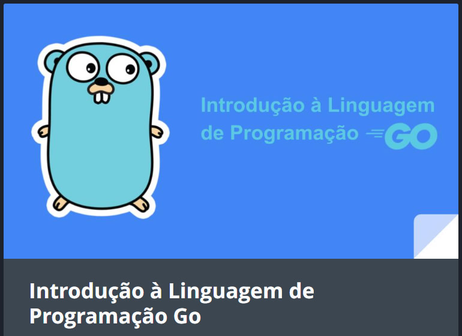

    

  

  
  

-------

# Projeto artigo técnico gerado por I.A.s

 > ℹ️ **NOTE:** Este é um fork do repositório desenvolvido durante o curso Santander 2024 - Fundamentos de IA para Devs da plataforma da [DIO](https://dio.me).

  

Projeto com o objetivo de gerar um artigo técnico com um layout rico, leitura agradável e com foco em promover sua autoridade técnica.

## Uma introdução à linguagem de programação GO
Este foi o tema escolhido para gerar o artigo. Neste fork estão descritos os meios utilizados para chegar ao resultado.

  
<a href="https://web.dio.me/articles/introducao-a-linguagem-de-programacao-go?back=%2Farticles&page=1&order=oldest" title="Introdução à Linguagem de Programação GO"> 📕Clique aqui para ler o artigo</a>

## 💻 Tecnologias utilizadas no projeto

- [ChatGPT](https://chat.openai.com/) - para título e conteúdo
- [Apresentações Google](https://docs.google.com/presentation/create?hl=pt-BR) - Para formatação de banners e Layouts

## 📄 Prompts e ferramentas

ChatGPT：

|   Ação   | prompt                                                                                                                                                                                                                                                                         |
| :------: | ------------------------------------------------------------------------------------------------------------------------------------------------------------------------------------------------------------------------------------------------------------------------------ |
|  título  | Crie 10 headlines para nomes de artigos sobre o assunto Iniciando com Linguagem de programação GO                                                                                                                                                                                        |
| conteúdo | Crie um texto para artigo explicando conceitos básicos da linguagem de programação GO com exemplos simples e comentados.
 | | REGRAS: 1-divida o artigo em apenas 6 parágrafos; 2-para cada parágrafo escreva o texto para um assundo de acordo com a lista [ASSUNTOS]; 3-dê um título a cada parágrafo; 4-crie um código de exemplo para cada parágrafo; 5-limite cada parágrafo em, no máximo, 10 linhas
 || ASSUNTOS: 1-Instalação; 2-Estrutura básica de um programa e como executá-lo; 3-Declaração de variáveis e funções e seus escopos; 4-Principais tipos de dados incluindo arrays; 5-Estruturas de controle: "if", "for" e "case"; 6-Um programa para criar e escrever em um arquivo texto; 7-Conclusão

## ✨ Features

- Conteúdo gerado via ChatGPT

## 📚 Materiais

- prompts utilizados

## 🛠️ Instruções de execução

Utilize os prompts acima em ferramentas de IA generativa para gerar o material base e utilize uma ferramenta de edição de documentos como apresentações do Google, P;ower Pint, Libreoffice , Indesign para diagramação, o passo a passo em vídeo pode ser conferido na plataforma da [DIO](https://dio.me).

## 👨‍💻 Expert

**Henry Moreira**
[GitHub](https://github.com/henrymoreirasilva) | [LinkedIn](https://www.linkedin.com/in/henry-moreira-silva/)
